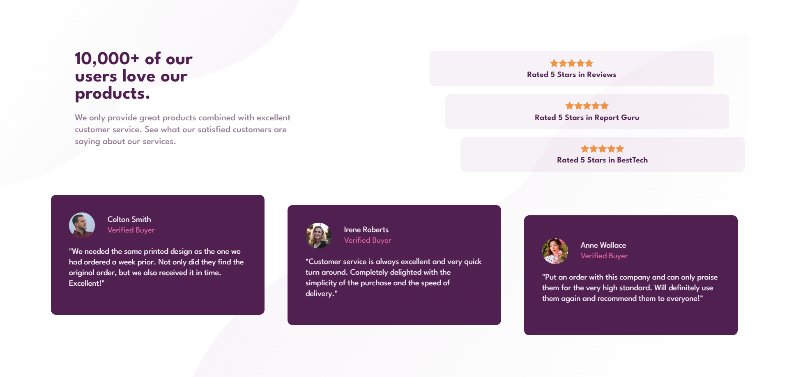

## Welcome! 👋

This is a solution to the [Social proof section challenge on Frontend Mentor](https://www.frontendmentor.io/challenges/social-proof-section-6e0qTv_bA).

### Screenshot

**Desktop version of the final product**

### Links

- Solution URL: [Frontend Mentor Challenge](https://www.frontendmentor.io/challenges/social-proof-section-6e0qTv_bA/hub)
- Live Site URL: [Live Site URL](joshhovis.github.io/Social-Proof/)

### Built with

- Semantic HTML5 markup
- CSS custom properties
- Flexbox
- Mobile-first workflow

## Author

- Website - [GitHub](https://github.com/joshhovis)
- LinkedIn - [LinkedIn](https://www.linkedin.com/in/joshua-hovis/)
- Frontend Mentor - [@joshhovis](https://www.frontendmentor.io/profile/joshhovis)